# Micro-ROS Renesas MCK-RA8T2 Motor sensorless tutorial

## Table of Contents

- [Overview](#overview)
- [Prerequisites](#prerequisites)
- [Project Setup](#project-setup)
  - [Project dependencies](#project-dependencies)
  - [Import the project into Renesas e2 Studio](#import-the-project-into-renesas-e2-studio)
  - [Project build settings](#project-build-settings)
  - [Building the project](#building-the-project)
- [Application code overview](#application-code-overview)
  - [Ethernet transport configuration](#ethernet-transport-configuration)
  - [Application task entrypoint](#application-task-entrypoint)
  - [Motor control overview](#motor-control-overview)
  - [Micro-ROS integration](#micro-ros-integration)
- [Project configuration overview](#project-configuration-overview)
- [Board configuration](#board-configuration)
  - [CPU Board Jumper settings](#cpu-board-jumper-settings)
  - [Inverter Board Jumper settings](#inverter-board-jumper-settings)
  - [Board connections](#board-connections)
- [Running the project application](#running-the-project-application)
  - [Launch the Micro-ROS Agent](#launch-the-micro-ros-agent)
  - [Run the project](#run-the-project)
  - [Send ROS 2 messages](#send-ros-2-messages)

## Overview

This tutorial demonstrates how to build distributed applications using **Micro-ROS** and **FreeRTOS** on **Renesas MCK-RA8T2** microcontrollers.
You will learn how to control the **MOONS R42BLD30L3** motor (included with the [Renesas Flexible Motor Control Kit](https://www.renesas.com/en/design-resources/boards-kits/mck-ra8t2)) in a **sensorless** configuration using **ROS 2** messages transmitted via **Ethernet**.

## Prerequisites

- Basic knowledge of C programming
- Familiarity with embedded systems concepts and FreeRTOS
- Understanding of networking fundamentals (helpful but not required)
- [Renesas Flexible Motor Control Kit](https://www.renesas.com/en/design-resources/boards-kits/mck-ra8t2)
- USB-C cable for debugging via the SEGGER J-Link port
- Ethernet cable for PC/Board communication using Micro-ROS
- [Docker](https://docs.docker.com/engine/install/ubuntu/) and [git](https://git-scm.com/) installed.

## Project Setup

### Project dependencies

To run this project, you’ll need the **Renesas e² Studio IDE v2025-10**, which can be downloaded from the official [Renesas website](https://www.renesas.com/en/software-tool/e2studio-information-ra-family).

You’ll also need **FSP v6.1**. Follow [this guide](https://github.com/micro-ROS/micro_ros_renesas2estudio_component/blob/kilted/fps_install_packs.md) to install the FSP package if it is not available by default.

To debug the project, the compiler requires **Python 3.10** binaries to be available on your system. You can install them by running:

```bash
sudo add-apt-repository ppa:deadsnakes/ppa
sudo apt update
sudo apt install -y python3.10 python3.10-dev
```

Additionally, Micro-ROS setup requires colcon to build the ROS 2 packages. Install the following dependencies:

```bash
pip3 install colcon-common-extensions catkin_pkg lark-parser empy
```

Finally, [Micro-ROS Agent](https://github.com/micro-ROS/micro-ROS-Agent) and [ROS 2](https://www.ros.org/) Kilted will be used to test the application:

```bash
# Micro-ROS Agent image
docker pull microros/micro-ros-agent:kilted
# ROS 2 image
docker pull ros:kilted
```

### Import the project into Renesas e2 Studio

First, clone the repository to your computer:

```bash
git clone --recurse-submodules https://github.com/eProsima-Private/micro-ros-renesas-mck-ra8t2-sensorlessmotor-poc
```

Open Renesas e2 Studio IDE, then import the project via `File > Open projects from file system... > Directory` and selecting the `MCK-RA8T2_motor_demo` subfolder of the cloned repository:

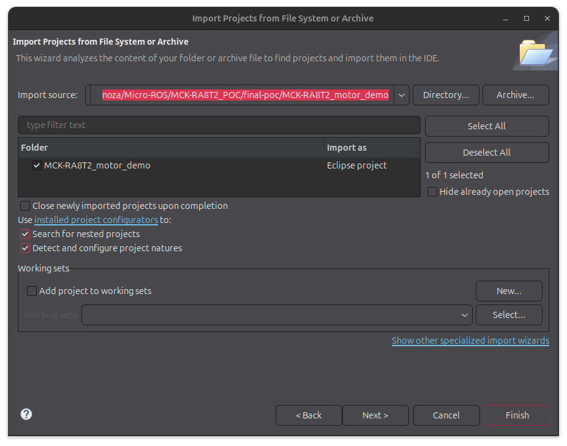

Click the `Finish` button to load the project into your workspace.

### Project build settings

To run the project, ensure that `arm-none-eabi-gcc` v13.2.1 is selected as the toolchain.

To check this, go to `Help > Add Renesas Toolchains` and check that `GNU ARM Embedded > 13.2.1` is enabled:

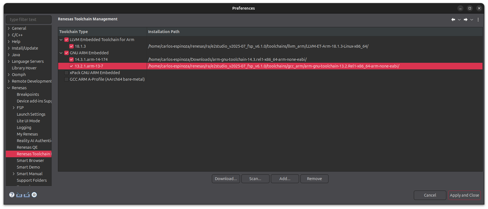

If not installed, click `Download...` button and select the correct version:

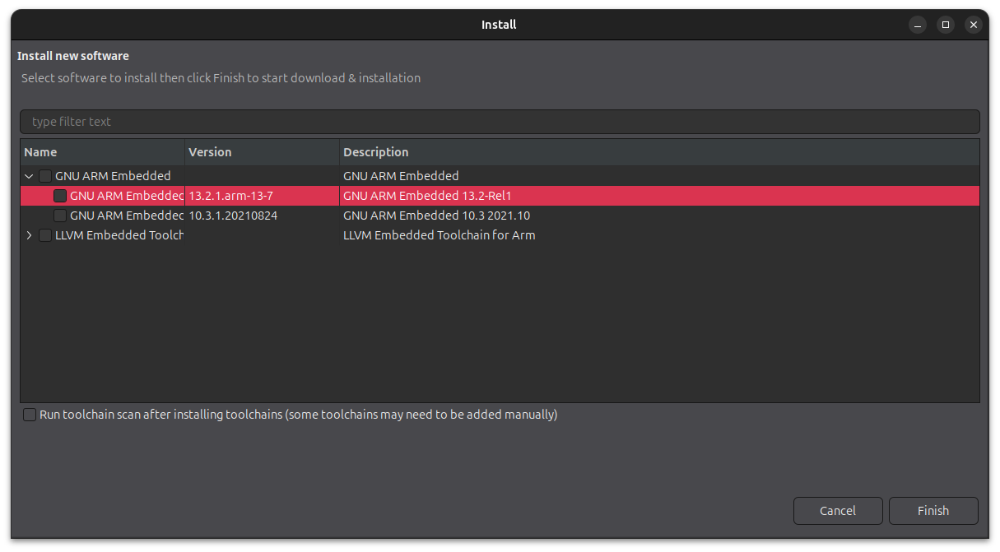

Open the project properties by right-clicking the project name in the project explorer and clicking `Properties`. In the project properties view, navigate to
`C/C++ Build > Tool Chain Editor` and confirm that `GCC ARM Embedded` is selected as the current toolchain:

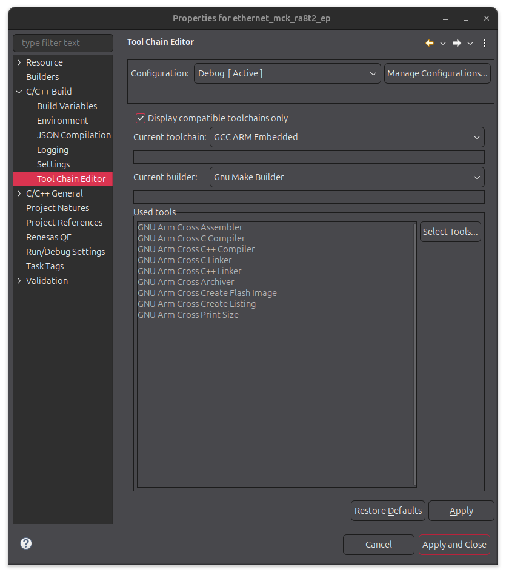

Next, go to `C/C++ Build > Settings > Toolchain` section and verify that the integrated toolchain version is set to v13.2.1:

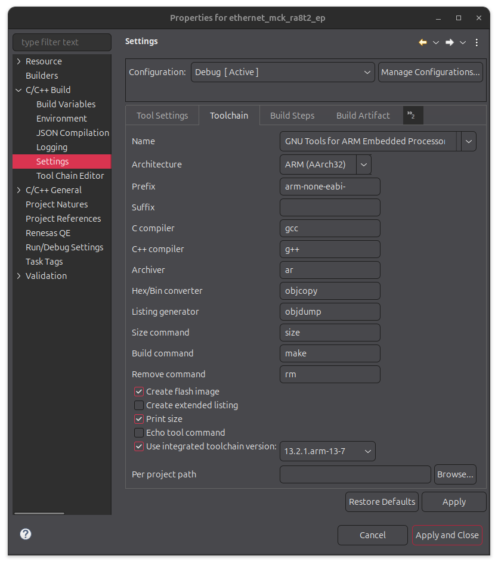

To avoid unexpected runtime errors, ensure that the processor configuration is correct. In the project properties view, navigate to `C/C++ Build > Settings > Tool Settings > Target Processor` and ensure that Cortex-M85 is selected in `Arm family` with Float ABI set to `FP Instructions (hard)`:

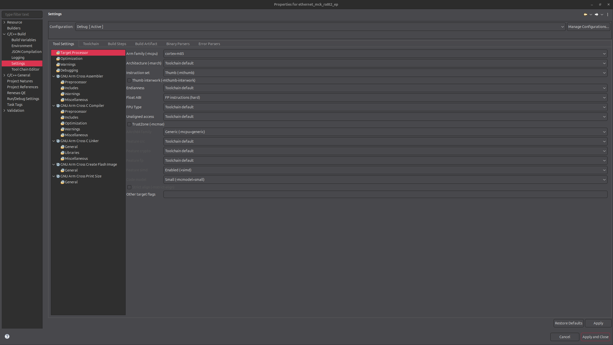

The project application is linked against the Micro-ROS library. The [Micro-ROS Renesas component](https://github.com/micro-ROS/micro_ros_renesas2estudio_component)
includes a Bash script for generating the library binaries.

In the project properties view, navigate to `C/C++ Build > Settings > Build Steps` and ensure that the following command:

```bash
cd ../micro_ros_renesas2estudio_component/library_generation && ./library_generation.sh "${cross_toolchain_flags}"
```

is added as a pre-build step. No post-build steps are required:

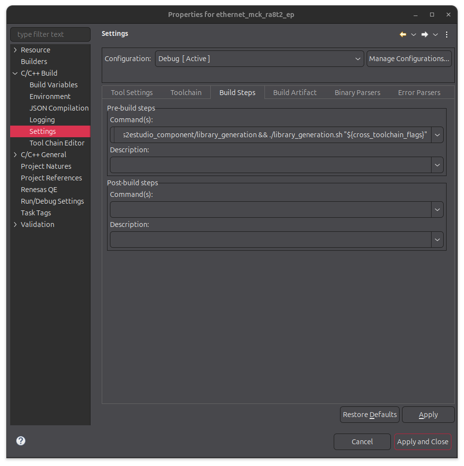

Next, navigate to `C/C++ Build > Settings > Tool Settings > GNU Arm Cross C Compiler` and ensure that

```bash
"${workspace_loc:/${ProjName}/micro_ros_renesas2estudio_component/libmicroros/include}"
```

is added under `Include Paths (-I)` section:

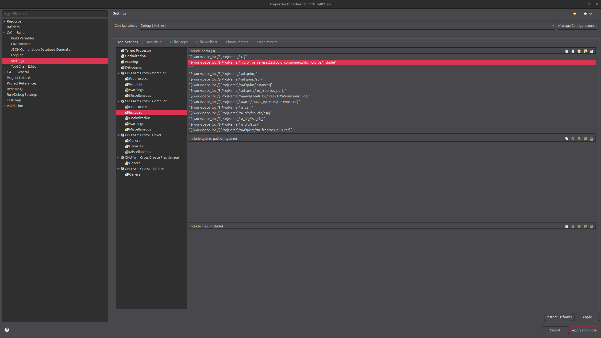

Finally, navigate to `C/C++ Build > Settings > Tool Settings > GNU Arm Cross C Linker > Libraries` and ensure that

```bash
"${workspace_loc:/${ProjName}/micro_ros_renesas2estudio_component/libmicroros}"
```

is added under `Library search path (-L)`, and that `microros` is added under `Libraries (-L)`

### Building the project

Before compiling the project, you need to generate the source code for the stack modules.
Open the configuration view by double-clicking the `configuration.xml` file, then click the Generate Project Content button in the top-right corner.
This will automatically generate the `ra/`, `ra_gen/`, and `ra_cfg/` folders.

Once build settings are properly configured, build the project by right-clicking the project name and selecting `Build Project`. During the first build, the Micro-ROS library packages will be set up, creating a `libmicroros` subfolder that contains the compiled Micro-ROS binary:

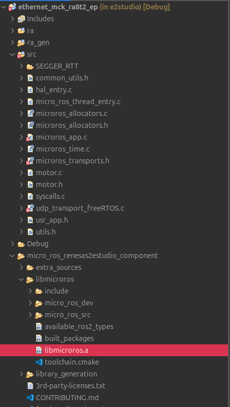

The initial build may fail when linking the application against the Micro-ROS library. Simply rebuild the project: now that the library is compiled, the process will complete successfully.

> **Note:** If you want to recompile the Micro-ROS library, delete the libmicroros folder manually before rebuilding.

## Application code overview

This project provides a minimal demonstration of integrating the Micro-ROS library into the [Renesas Flexible Motor Control Kit](https://www.renesas.com/en/design-resources/boards-kits/mck-ra8t2) to build IoT applications. The user can set the rotation speed of the included PMSM motor by sending ROS 2 messages to the board.

### Ethernet transport configuration

The Micro-ROS library allows using custom transports to establish communication between the board and the Micro-ROS Agent. This project is configured to use **Ethernet transport**.

On one hand, the `micro_ros_thread_entry.c` file contains the IP of the machine running the Micro-ROS Agent, and the port in which the Agent is listening for messages.

On the other hand, the `udp_transport_freeRTOS.c` file contains the transport configuration, including the static IP address assigned to the board.

By default, the application assumes that your Ethernet connection does not support DHCP and will try to use the configured static IP. Assigning an IP to the board dynamically using DHCP can be enabled by modifying the stack properties (see [Stack configuration section](#project-configuration-overview)).

### Application Task entrypoint

The project runs the entire Micro-ROS application inside a FreeRTOS task. Thus, our application defines an entrypoint function for this task — `micro_ros_thread_entry()` in the `micro_ros_thread_entry.c` file — which initializes the motor device and configures the Micro-ROS UDP transport defined in `udp_transport_freeRTOS.c`.

### Motor Control overview

Motor control logic is implemented in `motor.c`, using the [Motor Sensorless Vector Control API](https://renesas.github.io/fsp/group___m_o_t_o_r___s_e_n_s_o_r_l_e_s_s.html).

Initialization occurs via `mtr_init()`, which opens the driver and resets its internal state.

Once the motor device is initialized, the motor sensorless module will trigger the `mtr_callback_event` to inform the application
of different motor control events. In this project, the callback is used to check that the motor has not encountered any errors.

Incoming ROS 2 commands are handled by `process_motor_command()`, which receives a target speed in RPM:

- Positive values rotate clockwise, negative values counterclockwise, and 0 stops the motor.
- The input speed is normalized to be between a minimum and maximum speeds and configured using the `speedSet()` method of the motor API.

### Micro-ROS integration

The `microros_app()` function in `microros_app.c` sets up communication with other ROS 2 nodes using the [rclc](https://github.com/ros2/rclc) library.

It creates a subscription to the topic `/renesas_motor_topic`, expecting `std_msgs/msg/Int32` messages.

When a message is received, `motor_callback()` is invoked to adjust motor speed.

## Project configuration overview

The project can be configured by opening the `configuration.xml` file in Renesas e2 Studio IDE. Click the `Stacks` button in the bottom toolbar to open the `Stacks Configuration` view, which contains the following modules:

- A `FreeRTOS+TCP` networking module for ethernet communication, configured according to the [Micro-ROS transports setup guide](https://github.com/micro-ROS/micro_ros_renesas2estudio_component/blob/kilted/micro_ros_transports.md#udp-transport-freertos--tcp)
- A `Motor Sensorless Vector Control` module for motor control using the API described in the previous section, configured following the [Renesas Quick Start Example](https://github.com/renesas/ra-fsp-examples/tree/master/example_projects/mck_ra8t2/_quickstart/quickstart_mck_ra8t2_ep).

Each module's parameters can be viewed by selecting it and opening the `Properties` view (`Window > Show View > Properties`)

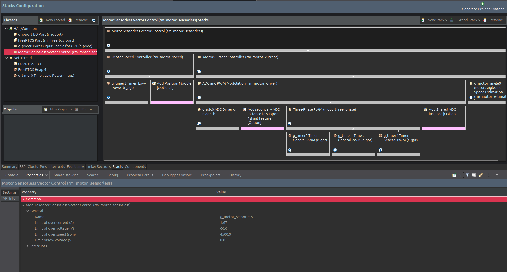

Some configurations have been adjusted to ensure proper functionality:

- **DHCP Settings**. By default, DHCP is disabled in the `FreeRTOS+TCP` module. Its properties are configured as follows:

| Property | Value |
|--|--|
| Use DHCP | Disable |
| DHCP Register Hostname | Disable |
| DHCP Uses Unicast | Disable |
| DHCP callback function | Disable |

- **Interrupt priorities**. On Cortex-M processors, FreeRTOS creates critical sections by masking interrupts up to the application defined maximum syscall interrupt priority.
Additionally, numerically low priority values are used to specify logically high interrupt priorities. Since motor-related interrupts do not use FreeRTOS API calls and require high priority, the Motor Speed Controller timer (`g_timer3`) should be configured with the highest priority (0). See [this note](https://www.freertos.org/Documentation/02-Kernel/03-Supported-devices/04-Demos/ARM-Cortex/RTOS-Cortex-M3-M4) for more details about FreeRTOS interrupt priorities.

- **AGT timer channels**. When multiple AGT timers use the same PCLKB clock, reusing a channel can prevent interrupts from triggering correctly. This project uses two AGT timers: `g_timer0`, used to trigger the internal cyclic callback required to compute the clocktime (see `microros_time.c` source file), and `g_timer3`, used to trigger the cyclic speed control callback implemented by the motor speed module. To avoid channel collisions, they are configured to use channels 0 and 1, respectively.

- **PWM synchronization**. Incorrect synchronization of the PWM timers in the `Three-Phase PWM` module can cause voltage errors when starting motor rotation. Ensure proper GPT clock configuration in the `Clocks` tab of the configuration view. The following image shows the clock setup used in this project:

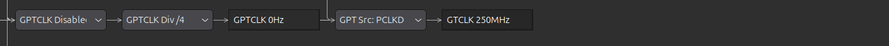

## Board configuration

To run the application, connect the CPU Board and the inverter board included in the Renesas Flexible Motor Control Kit. The required port connections are summarized below:

| Port | Board | Usage |
|--|--|--|
| CN13 | CPU board | Programming and debugging the application (J-Link port). Power supply |
| CN14 | CPU board | Ethernet connection |
| CN2 | Inverter board | Motor connection |

Make sure all short jumpers are configured as follows (factory default setting):

| Board | Pins | Configuration |
|--|--|--|
| Inverter Board | JP1, JP2, JP3, JP4, JP6, JP12, JP13 | 2-3pin |
| Inverter Board | JP5, JP7, JP8, JP9, JP10, JP11, JP14, JP15 | 1-2pin |
| CPU Board | JP1 | 1-2pin, 3-4pin, 5-6pin |
| CPU Board | JP2 | 1-2pin, 3-4pin, 9-10pin, 11-12pin |
| CPU Board | JP4 | 1-2pin |
| CPU Board | JP6 | 1-2pin |

### CPU Board Jumper settings

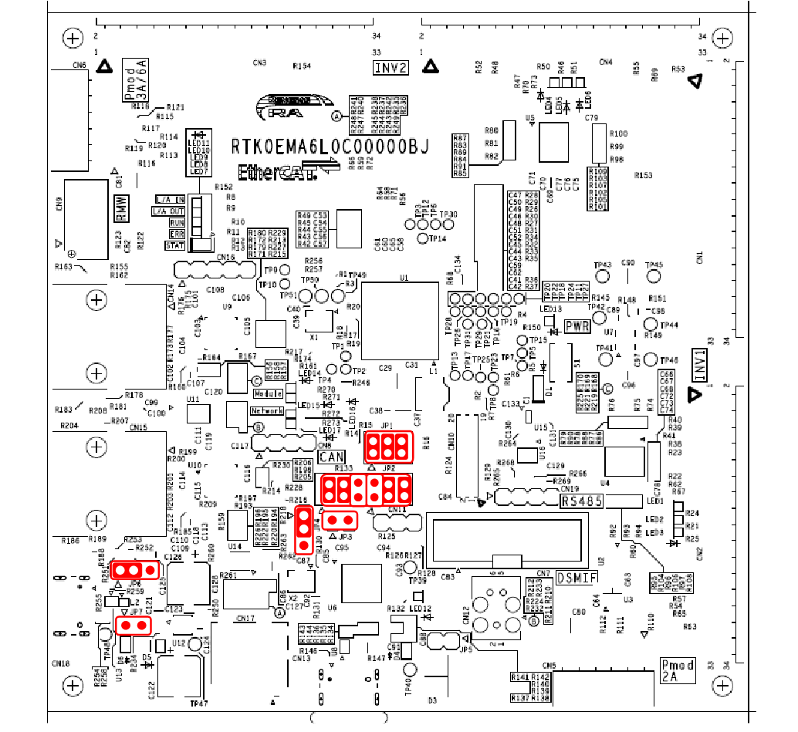

### Inverter Board Jumper settings

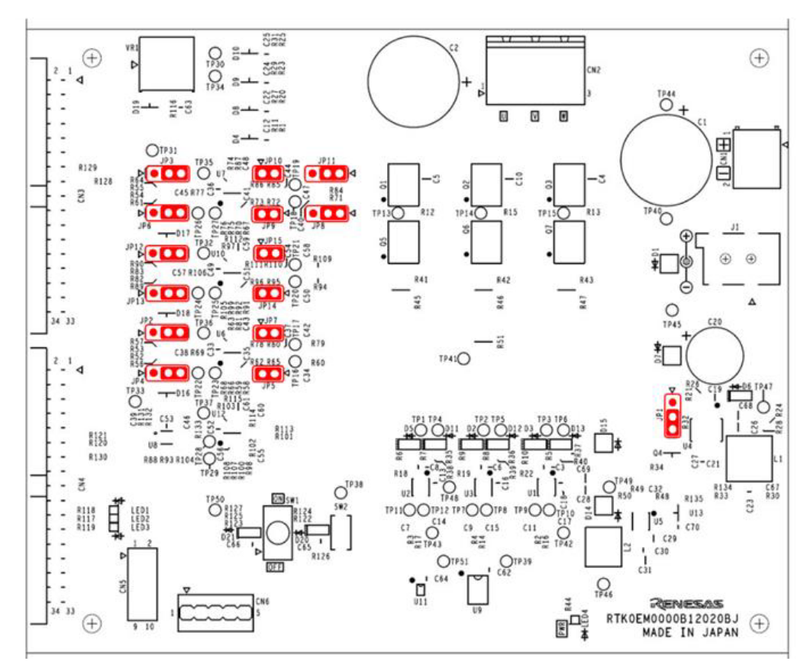

### Board connections

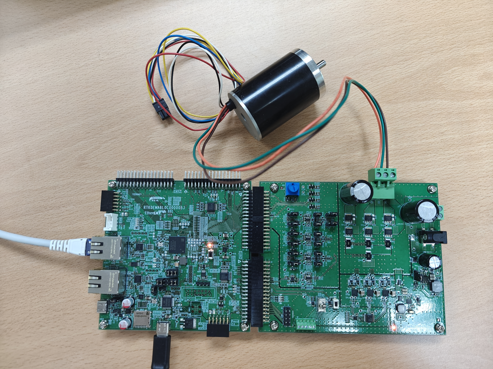

## Running the project application

Before running the application:

1. Ensure the board is properly configured and connected to the PC via USB-C and Ethernet. Check [Board configuration section](#board-configuration) for more details.
2. Verify that the Ethernet configuration in `udp_transport_freeRTOS.c` and `micro_ros_thread_entry.c` matches your network. Check [Ethernet transport configuration section](#ethernet-transport-configuration) for more details.

For this demonstration, the `192.168.1.0/24` subnet is used, with static IPs assigned as follows:

- Board: `192.168.1.180`
- PC (Micro-ROS Agent host): `192.168.1.100`
- Micro-ROS Agent listening port: `8889`

### Launch the Micro-ROS Agent

To enable communication between the board and other ROS 2 nodes, it is necessary to run the Micro-ROS Agent. The agent acts as a bridge between the board and the ROS 2 node that publishes motor commands, handling communication via UDP messages and creating the subscriber node required by the application.

To initialize a new Micro-ROS Agent instance on your PC, open a new terminal and run:

```bash
docker run -it --rm -v /dev:/dev -v /dev/shm:/dev/shm --privileged --net=host --ipc=host microros/micro-ros-agent:kilted udp4 --port 8889 -v6
```

### Run the project

Build the project. Then, right-click the project name and select `Debug As > Renesas GDB Hardware Debugging`. Skip initial breakpoints by clicking the `Resume` button in the top toolbar.

After a few seconds, the Micro-ROS Agent should display messages like:

```bash
[1761721771.203030] info     | ProxyClient.cpp    | create_participant       | participant created    | client_key: 0x6BB90FCB, participant_id: 0x000(1)
[1761721771.203151] debug    | UDPv4AgentLinux.cpp | send_message             | [** <<UDP>> **]        | client_key: 0x6BB90FCB, len: 14, data:
0000: 81 80 00 00 05 01 06 00 00 0A 00 01 00 00
[1761721771.297322] info     | ProxyClient.cpp    | create_topic             | topic created          | client_key: 0x6BB90FCB, topic_id: 0x000(2), participant_id: 0x000(1)
[1761721771.298181] debug    | UDPv4AgentLinux.cpp | recv_message             | [==>> UDP <<==]        | client_key: 0x6BB90FCB, len: 13, data:
0000: 81 00 00 00 0B 01 05 00 00 00 01 00 80
[1761721771.302558] info     | ProxyClient.cpp    | create_subscriber        | subscriber created     | client_key: 0x6BB90FCB, subscriber_id: 0x000(4), participant_id: 0x000(1)
[1761721771.302914] debug    | UDPv4AgentLinux.cpp | send_message             | [** <<UDP>> **]        | client_key: 0x6BB90FCB, len: 14, data:
0000: 81 80 02 00 05 01 06 00 00 0C 00 04 00 00
[1761721771.397835] info     | ProxyClient.cpp    | create_datareader        | datareader created     | client_key: 0x6BB90FCB, datareader_id: 0x000(6), subscriber_id: 0x000(4)
[1761721771.397905] debug    | UDPv4AgentLinux.cpp | send_message             | [** <<UDP>> **]        | client_key: 0x6BB90FCB, len: 14, data:
0000: 81 80 03 00 05 01 06 00 00 0D 00 06 00 00
```

If no messages appear and the board’s red LED flashes, communication has failed.
In that case, verify your network configuration and IP addresses.

### Send ROS 2 messages

After finishing the Board/Agent connection, open a new terminal in your laptop and run the ROS 2 container:

```bash
docker run --rm --net=host --ipc=host -it ros:kilted bash
```

Check that the ROS 2 topic for processing the motor commands appears in the topic list by running:

```bash
ros2 topic list
```

A `/renesas_motor_topic` topic should appear. Running `ros2 topic info /renesas_motor_topic` should report:

- Message type: `Int32`
- One subscriber (the Micro-ROS node running on the board)

Now, publish messages to control the motor:

#### Rotate clockwise (2000 RPM)

```bash
ros2 topic pub /renesas_motor_topic std_msgs/msg/Int32 "{data: 2000}" --once
```

#### Change speed (clockwise, 500 RPM)

```bash
ros2 topic pub /renesas_motor_topic std_msgs/msg/Int32 "{data: 500}" --once
```

#### Rotate counterclockwise (500 RPM)

```bash
ros2 topic pub /renesas_motor_topic std_msgs/msg/Int32 "{data: -500}" --once
```

#### Stop the motor

```bash
ros2 topic pub /renesas_motor_topic std_msgs/msg/Int32 "{data: 0}" --once
```
