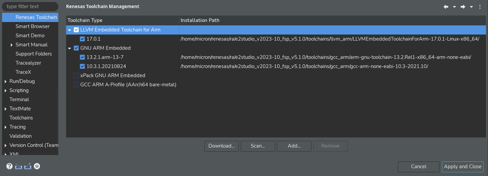

# micro-ROS demos for Renesas e<sup>2</sup> studio

[](https://github.com/micro-ROS/micro_ros_renesas_testbench/actions/workflows/ci.yml)
[](https://github.com/micro-ROS/micro_ros_renesas_testbench/actions/workflows/build_agent.yml)

This package provides example projects for using [micro-ROS](https://micro.ros.org/) in a [Renesas e<sup>2</sup> studio](https://www.renesas.com/us/en/software-tool/e-studio). All demos target [Renesas RA family](https://www.renesas.com/us/en/products/microcontrollers-microprocessors/ra-cortex-m-mcus), an ARM Cortex-M based MCU series, enabling a full micro-ROS compatibility for developing robotics and IoT applications.

- [micro-ROS demos for Renesas e<sup>2</sup> studio](#micro-ros-demos-for-renesas-esup2sup-studio)
  - [Target platform](#target-platform)
  - [Requirements](#requirements)
  - [Available demos](#available-demos)
  - [Demo Videos](#demo-videos)
  - [Getting started](#getting-started)
  - [Using the micro-ROS Agent](#using-the-micro-ros-agent)
  - [License](#license)
  - [Known Issues / Limitations](#known-issues--limitations)

---
## Target platform

| MCU                                                                                                                                                                             | Family    | Reference board                                                                                                                                                                       | Transports                                                                                                                       |
| ------------------------------------------------------------------------------------------------------------------------------------------------------------------------------- | --------- | ------------------------------------------------------------------------------------------------------------------------------------------------------------------------------------- | -------------------------------------------------------------------------------------------------------------------------------- |
| [RA6M5](https://www.renesas.com/us/en/products/microcontrollers-microprocessors/ra-cortex-m-mcus/ra6m5-200mhz-arm-cortex-m33-trustzone-highest-integration-ethernet-and-can-fd) | RA Series | [EK-RA6M5](https://www.renesas.com/us/en/products/microcontrollers-microprocessors/ra-cortex-m-mcus/ek-ra6m5-evaluation-kit-ra6m5-mcu-group)                                          | USB-CDC <br /> Serial UART <br /> UDP (FreeRTOS + TCP) <br /> UDP (ThreadX + NetX) <br /> TCP (AWS Secure Sockets) <br /> CAN FD |
| [RA6T2](https://www.renesas.com/us/en/products/microcontrollers-microprocessors/ra-cortex-m-mcus/ra6t2-240mhz-arm-cortex-m33-trustzone-high-real-time-engine-motor-control)     | RA Series | [MCK-RA6T2](https://www.renesas.com/us/en/products/microcontrollers-microprocessors/ra-cortex-m-mcus/rtk0ema270s00020bj-mck-ra6t2-renesas-flexible-motor-control-kit-ra6t2-mcu-group) | Serial UART <br /> CAN FD                                                                                                        |


## Requirements

- [Renesas e<sup>2</sup> studio](https://www.renesas.com/us/en/software-tool/e-studio) for Linux<sup>1</sup>
- FSP v4.4.0 board packs for Renesas e<sup>2</sup> studio: [Details](https://github.com/micro-ROS/micro_ros_renesas2estudio_component/blob/iron/fps_install_packs.md).
- GNU Arm Embedded Toolchain v10.3.1.20210824 (Other compatible toolchain may work).
- [Install colcon](https://colcon.readthedocs.io/en/released/user/installation.html) and dependencies, for example with:

```bash
pip3 install colcon-common-extensions catkin_pkg lark-parser empy
```

*<sup>1</sup> Currently only support for Linux is available*
## Available demos

| Board     | RTOS                                                        | Transport | Description                                                                      | Folder                                                                                     |
| --------- | ----------------------------------------------------------- | --------- | -------------------------------------------------------------------------------- | ------------------------------------------------------------------------------------------ |
| EK-RA6M5  | Bare Metal                                                  | CAN FD    | micro-ROS using a CAN FD transport                                               | [`micro_ros_can`](Boards/EK_RA6M5/micro_ros_can)                                           |
|           | Bare Metal                                                  | UART      | micro-ROS using a serial UART transport                                          | [`micro_ros_uart`](Boards/EK_RA6M5/micro_ros_uart)                                         |
|           | Bare Metal                                                  | USB       | micro-ROS using a serial USB-CDC transport                                       | [`micro_ros_usb`](Boards/EK_RA6M5/micro_ros_usb)                                           |
|           | [FreeRTOS](https://www.freertos.org/)                       | UDP       | micro-ROS using a network transport and FreeRTOS + TCP                           | [`micro_ros_udp_freertos`](Boards/EK_RA6M5/micro_ros_udp_freertos)                         |
|           | [FreeRTOS](https://www.freertos.org/)                       | UDP       | micro-ROS using a network transport and FreeRTOS + TCP in a multithread approach | [`micro_ros_udp_freertos_multithread`](Boards/EK_RA6M5/micro_ros_udp_freertos_multithread) |
|           | [FreeRTOS](https://www.freertos.org/)                       | TCP       | micro-ROS using a wifi network transport and AWS Secure Sockets                  | [`micro_ros_tcp_freertos`](Boards/EK_RA6M5/micro_ros_tcp_freertos)                         |
|           | [ThreadX](https://azure.microsoft.com/en-us/services/rtos/) | UDP       | micro-ROS using a network transport and ThreadX + NetX                           | [`micro_ros_udp_threadx`](Boards/EK_RA6M5/micro_ros_udp_threadX)                           |
| MCK-RA6T2 | Bare Metal                                                  | CAN FD    | micro-ROS using a CAN FD transport                                               | [`micro_ros_can`](Boards/MCK_RA6T2/micro_ros_can)                                          |
|           | Bare Metal                                                  | UART      | micro-ROS using a serial UART transport                                          | [`micro_ros_uart`](Boards/MCK_RA6T2/micro_ros_uart)                                        |
| EK-RA8M1  | [ThreadX](https://azure.microsoft.com/en-us/services/rtos/) | UDP       | micro-ROS using a network transport and ThreadX + NetX                           | [`micro_ros_udp_threadx`](Boards/EK_RA8M1/micro_ros_udp_threadX)                           |

## Demo Videos
A set of step-by-step demonstration videos for micro-ROS with Renesas e2studio
| Board     | Description                                      | Link                                                                                                 |
| --------- | ------------------------------------------------ | ---------------------------------------------------------------------------------------------------- |
| EK-RA6M5  | micro-ROS getting started video                  | [link](https://www.youtube.com/watch?v=lKCrhmjYaEM&list=PL-Kh3H15FsNTD8A8wD0_iMnvhDsqw-rga&index=15) |
| EK-RA6M5  | micro-ROS Service demo                           | [link](https://www.youtube.com/watch?v=HeczpVEaknE)                                                  |
| EK-RA6M5  | micro-ROS over Wifi                              | [link](https://www.youtube.com/watch?v=SaXdwTzPI4E)                                                  |
| EK-RA6M5  | micro-ROS publisher demo                         | [link](https://www.youtube.com/watch?v=-9nJlE1oCBQ)                                                  |
| EK-RA6M5  | micro-ROS parameter demo                         | [link](https://www.youtube.com/watch?v=_FRAoU1uFwk&list=PL-Kh3H15FsNTD8A8wD0_iMnvhDsqw-rga&index=13) |
| MCK-RA6T2 | BLDC Motor Controller using Microros over CAN FD | [link](https://www.youtube.com/watch?v=yQc0EVPqKTE)                                                  |

## Getting started

For using those demos, just clone recursively this repository in your computer with:

```bash
git clone --recurse-submodules https://github.com/micro-ROS/micro_ros_renesas_demos
```

Open Renesas e<sup>2</sup> studio, import some of them, and finally build and flash

## Using the micro-ROS Agent

It is possible to use a **micro-ROS Agent** just by using this docker command:

```bash
# UDPv4 micro-ROS Agent
docker run -it --rm -v /dev:/dev -v /dev/shm:/dev/shm --privileged --net=host microros/micro-ros-agent:$ROS_DISTRO udp4 --port 8888 -v6

# TCPv4 micro-ROS Agent
docker run -it --rm -v /dev:/dev -v /dev/shm:/dev/shm --privileged --net=host microros/micro-ros-agent:$ROS_DISTRO tcp4 --port 8888 -v6

# Serial micro-ROS Agent
docker run -it --rm -v /dev:/dev -v /dev/shm:/dev/shm --privileged --net=host microros/micro-ros-agent:$ROS_DISTRO serial --dev [YOUR BOARD PORT] -v6

# CAN FD micro-ROS Agent
docker run -it --rm -v /dev:/dev -v /dev/shm:/dev/shm --privileged --net=host microros/micro-ros-agent:$ROS_DISTRO canfd --dev [YOUR CAN INTERFACE] -v6
```

There are some other options for using the micro-ROS Agent:
 - Building it in a ROS 2 environment: [Details](https://micro.ros.org/docs/tutorials/core/first_application_linux/).
 - Using a [snap package](https://snapcraft.io/micro-ros-agent).

## Addendum, EK-RA8M1
The EK-RA8M1 introduced some nuances when it comes to e2_studio, only versions >= 5.0.0 of the Renesas FSP are supported, not only that but as of 29/01/2024
the arm toolchain has to be installed manually as it seems to not be detected out of the box by e2_studio. 
As of right now the only demo that has been tested is the udp_threadx demo, for it the toolchain version used was ` arm-gnu-toolchain-13.2.Rel1 ` and the FSP used was 5.1.0
### Installing the Toolchain
You can fetch yourself the latest version of the arm toolchain from [here](https://developer.arm.com/downloads/-/arm-gnu-toolchain-downloads) install it and place it near the place inside ```toolchains/gcc_arm/``` the directory path should look something like the following:
```bash
./e2studio_v2023-10_fsp_v5.1.0/toolchains/gcc_arm/arm-gnu-toolchain-13.2.Rel1-x86_64-arm-none-eabi/
```
If you are strungling to find the fsp folder, the fsp installer on linux tends to install it by default, inside renesas folder on the home directory `~/renesas/ra`
#### Adding the toolchain to e2_studio
E2_studio seems to be unable to auto detect added toolchains so you will need to go to Help > "Add Renesas Toolchains" > and select the folder where you placed the toolchain up to the first folder, in this case `arm-gnu-toolchain-13.2.Rel1-x86_64-arm-none-eabi` and click ok, after that you should be able to select the toolchain when creating a new project.



### Minor Fixes to Compiler Settings

Apparently some flags seem to be ommited and one of them is `--specs=rdimon.specs`, go to ` Project > Properties > C/C++ Build > Settings > Tool Settings > Gnu Arm Cross C++ Linker > Miscellaneous ` and add the flag to "Other linker flags"
**Note:** Not setting up the aforementioned flag will result in some issues regarding the libnano, in which the linker will complain about non existing symbols such as _kill, etc..

### Tweaks regarding Ethernet

#### Tweaks to the phy stack
Go to the g_ether_phy0 stack and set the `PHY-LSI Address` to `5`.
#### Tweaks to Pin Region
Go to pins tab > Connectivity:ETHER_RMII and set the `Pin Group Selection` to `_B only` this will cause the various pins to change from board region. 
**Note:** ET0_LINKSTA will most likely give an error, you can easily fix this by either setting it to P403 or to None depending on your needs
Then on the board physically disconnect the Jumper J61, it should be located in the center of the board, inside the Special Feature Access Area, close to the native access pin area.

**Note:** Disconnecting this jumper may affect I3C functionality, bellow you will find a link that gives of information on how this jumper operates alongside with other functionalities.

For more in-depth information on the location, purpose, and usage you can find it at [Renesas Users Manual](https://www.renesas.com/us/en/document/mat/ek-ra8m1-users-manual?r=25448206) for the EK-RA8M1 board on page 33(Rev 1.00 Oct 2023).

## License

This repository is open-sourced under the Apache-2.0 license. See the [LICENSE](LICENSE) file for details.
To find a list of other open-source components included in this repository,
see the file [3rd-party-licenses.txt](3rd-party-licenses.txt).


## Known Issues / Limitations

There are no known limitations.
